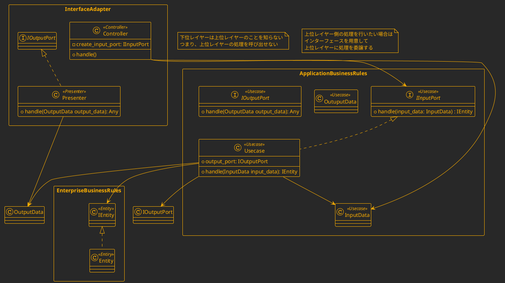

# クリーンアーキテクチャテンプレート

```plantuml

@startuml
!theme crt-amber

package EnterpriseBusinessRules <<Rectangle>> {
  class IEntity <<Entity>> {
  }
    
  class Entity <<Entiry>> implements IEntity {
      
  }
}


package ApplicationBusinessRules <<Rectangle>>{
    class InputData <<Usecase>> {
    }
    
    interface IInputPort <<Usecase>> {
        + handle(input_data: InputData) : IEntity
    }
    
    class OutuputData <<Usecase>> {
    }
    
    interface IOutputPort <<Usecase>> {
        + handle(OutputData output_data): Any
    }

    class Usecase <<Usecase>> Implements IInputPort {
        + output_port: IOutputPort
        +handle(InputData input_data): IEntity
    }
}


package InterfaceAdapter <<Rectangle>> {
    class Controller <<Controller>> {
        - create_input_port: IInputPort
        + handle()
    }
    
    class Presenter <<Presenter>> implements IOutputPort {
        + handle(OutputData output_data): Any
    }
}


/'Connect'/
/'InterfaceAdapter'/
Controller --> IInputPort
Controller --> InputData
Presenter --> OutputData
/'ApplicationBusinessRules'/
Usecase --> IOutputPort
Usecase --> IEntity
Usecase --> InputData
Usecase --> OutputData


InterfaceAdapter -down[hidden]- ApplicationBusinessRules
ApplicationBusinessRules -down[hidden]- EnterpriseBusinessRules

/'Note'/

note "下位レイヤーは上位レイヤーのことを知らない\nつまり、上位レイヤーの処理を呼び出せない" as N1
note "上位レイヤー側の処理を行いたい場合は\nインターフェースを用意して\n上位レイヤーに処理を委譲する" as N2

@enduml

```
